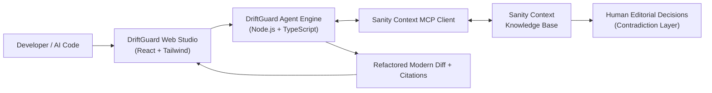

# 🛡️ DriftGuard: The Deprecated AI-Code Sanitizer & Refactor Agent

> **Submission for the Sanity Hackathon — Path 1: Ship an agent that queries real content**  
> *Grounded in Sanity Context Knowledge Bases via the Model Context Protocol (MCP)*

---

## The Problem

AI coding assistants (ChatGPT, GitHub Copilot, Cursor) frequently generate code with **deprecated or broken APIs** because their training datasets are saturated with obsolete tutorials and old StackOverflow answers. When frameworks release breaking changes, developers paste code that looks correct but crashes in production.

## The Solution: DriftGuard

DriftGuard intercepts developer and AI-generated code, audits it against an authoritative **Sanity Context Knowledge Base**, flags conflicting documentation, and refactors it to canonical modern standards.

### Key Capabilities
* **Sanity Context via MCP:** Connects directly to Sanity Knowledge Bases using the open **Model Context Protocol**.
* **Contradiction Resolution Showcase:** Highlights when community tutorials conflict with official changelogs, displaying the human-verified ruling made in the Sanity Studio.
* **Line-by-Line Diagnostics:** Pinpoints deprecated imports, methods, and configurations with severity indicators (`CRITICAL`, `HIGH`, `MEDIUM`).
* **Source Attribution:** Every diagnostic item links to the exact section in the official documentation or GitHub release.
* **One-Click Refactoring:** Automatically generates modern, type-safe replacements with a side-by-side diff view.

---

## Supported Ecosystems & Knowledge Bases

1. **Vercel AI SDK (v3 to v4):**
   * Deprecation of `StreamingTextResponse` and `OpenAIStream`
   * Migration to unified `streamText()` and `toDataStreamResponse()`
2. **Next.js (v14 to v15):**
   * Asynchronous `params` and `searchParams` in Server Components
   * Asynchronous `cookies()` and `headers()`
   * Eradicating legacy `getServerSideProps` in App Router
3. **Pydantic (v1 to v2):**
   * Transition from `class Config:` to `model_config = ConfigDict(...)`
   * Transition from `@validator` to `@field_validator`
   * Transition from `.dict()` to `.model_dump()`

---

## Architecture



---

## Getting Started

### Prerequisites
* **Node.js**: v18+ (tested on Node v24)
* **npm**: v10+

### Installation

```bash
# 1. Clone repository and navigate to root
cd driftguard

# 2. Install server dependencies
cd server
npm.cmd install

# 3. Install client dependencies
cd ../client
npm.cmd install
```

### Running Locally

```bash
# In terminal 1 (start agent server on port 3001)
cd server
npm.cmd run dev

# In terminal 2 (start web client on port 5173)
cd client
npm.cmd run dev
```

Open [http://localhost:5173](http://localhost:5173) in your browser.

---

## Hackathon Pitch & Walkthrough

* **[Pitch Script (2-minute video)](./demo/PITCH_SCRIPT.md)**: Ready-to-record walkthrough script.
* **[Judging Walkthrough](./demo/JUDGING_WALKTHROUGH.md)**: Breakdown against the 4 official evaluation rubrics.
